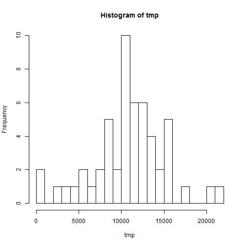
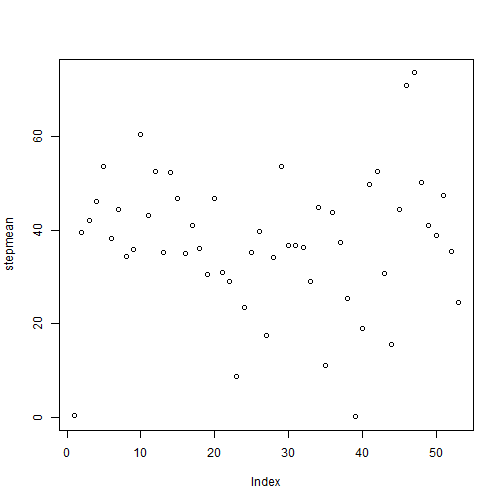
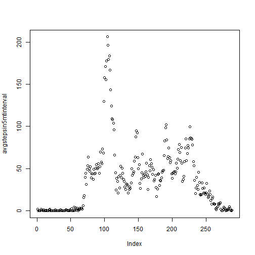
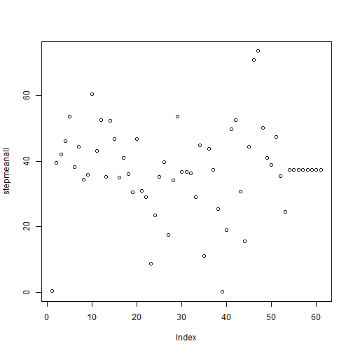

---
title:"PA1_template"
output:html_document
---
Course: Reproducible Research PA1_template
Author: Priyantha Perera
Date: August 16 2015


```r
setwd("C:/Users/Priyantha/Coursera/Reproducible Research/week2")

library(data.table)
library(stats)
library(dplyr)
```


```r
data <- read.csv("activity.csv", stringsAsFactors=FALSE)
```

```
## Warning in file(file, "rt"): cannot open file 'activity.csv': No such file
## or directory
```

```
## Error in file(file, "rt"): cannot open the connection
```

```r
head(data)
```

```
##   steps      date interval
## 1    NA 10/1/2012        0
## 2    NA 10/1/2012        5
## 3    NA 10/1/2012       10
## 4    NA 10/1/2012       15
## 5    NA 10/1/2012       20
## 6    NA 10/1/2012       25
```

```r
dim(data)
```

```
## [1] 17568     3
```

```r
str(data)
```

```
## 'data.frame':	17568 obs. of  3 variables:
##  $ steps   : int  NA NA NA NA NA NA NA NA NA NA ...
##  $ date    : chr  "10/1/2012" "10/1/2012" "10/1/2012" "10/1/2012" ...
##  $ interval: int  0 5 10 15 20 25 30 35 40 45 ...
```

```r
unique(data$date)
```

```
##  [1] "10/1/2012"  "10/2/2012"  "10/3/2012"  "10/4/2012"  "10/5/2012" 
##  [6] "10/6/2012"  "10/7/2012"  "10/8/2012"  "10/9/2012"  "10/10/2012"
## [11] "10/11/2012" "10/12/2012" "10/13/2012" "10/14/2012" "10/15/2012"
## [16] "10/16/2012" "10/17/2012" "10/18/2012" "10/19/2012" "10/20/2012"
## [21] "10/21/2012" "10/22/2012" "10/23/2012" "10/24/2012" "10/25/2012"
## [26] "10/26/2012" "10/27/2012" "10/28/2012" "10/29/2012" "10/30/2012"
## [31] "10/31/2012" "11/1/2012"  "11/2/2012"  "11/3/2012"  "11/4/2012" 
## [36] "11/5/2012"  "11/6/2012"  "11/7/2012"  "11/8/2012"  "11/9/2012" 
## [41] "11/10/2012" "11/11/2012" "11/12/2012" "11/13/2012" "11/14/2012"
## [46] "11/15/2012" "11/16/2012" "11/17/2012" "11/18/2012" "11/19/2012"
## [51] "11/20/2012" "11/21/2012" "11/22/2012" "11/23/2012" "11/24/2012"
## [56] "11/25/2012" "11/26/2012" "11/27/2012" "11/28/2012" "11/29/2012"
## [61] "11/30/2012"
```

```r
datanaomit <- na.omit(data)
dim(datanaomit)
```

```
## [1] 15264     3
```

```r
head(datanaomit)
```

```
##     steps      date interval
## 289     0 10/2/2012        0
## 290     0 10/2/2012        5
## 291     0 10/2/2012       10
## 292     0 10/2/2012       15
## 293     0 10/2/2012       20
## 294     0 10/2/2012       25
```

```r
dim(datanaomit)
```

```
## [1] 15264     3
```

```r
x <- datanaomit[,2]
class(x)
```

```
## [1] "character"
```

```r
unique(x)
```

```
##  [1] "10/2/2012"  "10/3/2012"  "10/4/2012"  "10/5/2012"  "10/6/2012" 
##  [6] "10/7/2012"  "10/9/2012"  "10/10/2012" "10/11/2012" "10/12/2012"
## [11] "10/13/2012" "10/14/2012" "10/15/2012" "10/16/2012" "10/17/2012"
## [16] "10/18/2012" "10/19/2012" "10/20/2012" "10/21/2012" "10/22/2012"
## [21] "10/23/2012" "10/24/2012" "10/25/2012" "10/26/2012" "10/27/2012"
## [26] "10/28/2012" "10/29/2012" "10/30/2012" "10/31/2012" "11/2/2012" 
## [31] "11/3/2012"  "11/5/2012"  "11/6/2012"  "11/7/2012"  "11/8/2012" 
## [36] "11/11/2012" "11/12/2012" "11/13/2012" "11/15/2012" "11/16/2012"
## [41] "11/17/2012" "11/18/2012" "11/19/2012" "11/20/2012" "11/21/2012"
## [46] "11/22/2012" "11/23/2012" "11/24/2012" "11/25/2012" "11/26/2012"
## [51] "11/27/2012" "11/28/2012" "11/29/2012"
```

```r
datetime <- strptime(x, format="%m/%d/%Y", tz="EST")

head(datetime)
```

```
## [1] "2012-10-02 EST" "2012-10-02 EST" "2012-10-02 EST" "2012-10-02 EST"
## [5] "2012-10-02 EST" "2012-10-02 EST"
```

```r
datanaomit2 <-cbind(datanaomit,datetime)
names(datanaomit2)
```

```
## [1] "steps"    "date"     "interval" "datetime"
```

```r
A<-unique(datetime)
```

Total number of steps taken per day calculation
 

```r
tmp <-NULL

for (i in 1:length(A)){

  stepsum <- sum(subset(datanaomit,datanaomit2$datetime==A[i])[,1])

  if (is.null(tmp)) tmp<-stepsum else tmp<-c(tmp,stepsum)

}


steps <- as.data.frame(tmp)
steps <- data.frame(A,steps)
names(steps)<- c("date", "steps")
steps
```

```
##          date steps
## 1  2012-10-02   126
## 2  2012-10-03 11352
## 3  2012-10-04 12116
## 4  2012-10-05 13294
## 5  2012-10-06 15420
## 6  2012-10-07 11015
## 7  2012-10-09 12811
## 8  2012-10-10  9900
## 9  2012-10-11 10304
## 10 2012-10-12 17382
## 11 2012-10-13 12426
## 12 2012-10-14 15098
## 13 2012-10-15 10139
## 14 2012-10-16 15084
## 15 2012-10-17 13452
## 16 2012-10-18 10056
## 17 2012-10-19 11829
## 18 2012-10-20 10395
## 19 2012-10-21  8821
## 20 2012-10-22 13460
## 21 2012-10-23  8918
## 22 2012-10-24  8355
## 23 2012-10-25  2492
## 24 2012-10-26  6778
## 25 2012-10-27 10119
## 26 2012-10-28 11458
## 27 2012-10-29  5018
## 28 2012-10-30  9819
## 29 2012-10-31 15414
## 30 2012-11-02 10600
## 31 2012-11-03 10571
## 32 2012-11-05 10439
## 33 2012-11-06  8334
## 34 2012-11-07 12883
## 35 2012-11-08  3219
## 36 2012-11-11 12608
## 37 2012-11-12 10765
## 38 2012-11-13  7336
## 39 2012-11-15    41
## 40 2012-11-16  5441
## 41 2012-11-17 14339
## 42 2012-11-18 15110
## 43 2012-11-19  8841
## 44 2012-11-20  4472
## 45 2012-11-21 12787
## 46 2012-11-22 20427
## 47 2012-11-23 21194
## 48 2012-11-24 14478
## 49 2012-11-25 11834
## 50 2012-11-26 11162
## 51 2012-11-27 13646
## 52 2012-11-28 10183
## 53 2012-11-29  7047
```
Histogram of total number of steps taken each day

```r
hist(tmp, breaks = 20)
```

 

Computing the step means


```r
tmpcount <-NULL

for (i in 1:length(A)){

  stepcount <- length(subset(datanaomit,datanaomit2$datetime==A[i])[,1])

  if (is.null(tmpcount)) tmpcount<-stepcount else tmpcount<-c(tmpcount,stepcount)

}


stepmean <- tmp/stepcount

plot(stepmean)
```

 

Median calculation


```r
tmpmed <-NULL
for (i in 1:length(A)){

  stepmed <- median(subset(datanaomit,datanaomit2$datetime==A[i])[,1])

  if (is.null(tmpmed)) tmpmed<-stepmed else tmpmed<-c(tmpmed,stepmed)

}

tmpmed
```

```
##  [1] 0 0 0 0 0 0 0 0 0 0 0 0 0 0 0 0 0 0 0 0 0 0 0 0 0 0 0 0 0 0 0 0 0 0 0
## [36] 0 0 0 0 0 0 0 0 0 0 0 0 0 0 0 0 0 0
```

Time series plot of 5 -minute interval avg # of steps taken across all days


```r
index <- rep(1:stepcount[1],length(A))
indexeddata <- data.frame(index,datanaomit)
head(indexeddata)
```

```
##     index steps      date interval
## 289     1     0 10/2/2012        0
## 290     2     0 10/2/2012        5
## 291     3     0 10/2/2012       10
## 292     4     0 10/2/2012       15
## 293     5     0 10/2/2012       20
## 294     6     0 10/2/2012       25
```

```r
avgstepsin5mtinterval <-NULL

for (i in 1:stepcount[1]){

                tmpts <- sum(subset(indexeddata[,2],indexeddata$index==i))/length(unique(x))


  if (is.null(avgstepsin5mtinterval)) avgstepsin5mtinterval<-tmpts else avgstepsin5mtinterval<-c(avgstepsin5mtinterval, tmpts)


}

plot(avgstepsin5mtinterval)
```

 

Finding the maximum average and which 5 minute interval it occurs


```r
maxsteps <- max(avgstepsin5mtinterval)
maxsteps
```

```
## [1] 206.1698
```

```r
rowindexmax <- match(maxsteps, avgstepsin5mtinterval)
```

The maximum of the daily average number of steps in 5 minute intervals occur in the interval:  


```r
rowindexmax
```

```
## [1] 104
```

Missing value handling
We are going to substitute missing values with the average number of steps in the daily 5 minute intervals averaged over all days.

Here is the code and results of total numbr of missing values


```r
(dim(data)-dim(datanaomit))[1]
```

```
## [1] 2304
```

This is to visually observe what the missing value data looks like


```r
datana <-data[is.na(data[,1]),]

dim(datana)
```

```
## [1] 2304    3
```

```r
names(datana)
```

```
## [1] "steps"    "date"     "interval"
```

```r
unique(datana$date)
```

```
## [1] "10/1/2012"  "10/8/2012"  "11/1/2012"  "11/4/2012"  "11/9/2012" 
## [6] "11/10/2012" "11/14/2012" "11/30/2012"
```

```r
View(datana)
```

By inspection of datana we observe that there are 8 different days with "NA"s. 


```r
(dim(datana)/288)[1]
```

```
## [1] 8
```

This implies that all 8 days had all the observations missing.
We will replicate "tmpts", the average number of steps  in 5 minute interval "missingdays" = 8 times.


```r
missingdays<-dim(datana)[1]/288

missingvaluefill <- rep(avgstepsin5mtinterval, missingdays)
```

Now replace the "steps" column of datana by the "missingvaluefill" values


```r
datana[,1] <- missingvaluefill
head(datana)
```

```
##       steps      date interval
## 1 1.7169811 10/1/2012        0
## 2 0.3396226 10/1/2012        5
## 3 0.1320755 10/1/2012       10
## 4 0.1509434 10/1/2012       15
## 5 0.0754717 10/1/2012       20
## 6 2.0943396 10/1/2012       25
```

```r
head(datanaomit)
```

```
##     steps      date interval
## 289     0 10/2/2012        0
## 290     0 10/2/2012        5
## 291     0 10/2/2012       10
## 292     0 10/2/2012       15
## 293     0 10/2/2012       20
## 294     0 10/2/2012       25
```

```r
names(datana)
```

```
## [1] "steps"    "date"     "interval"
```

```r
names(datanaomit)
```

```
## [1] "steps"    "date"     "interval"
```

```r
class(datana)
```

```
## [1] "data.frame"
```

```r
class(datanaomit)
```

```
## [1] "data.frame"
```

```r
datana[,1] <- missingvaluefill
head(datana)
```

```
##       steps      date interval
## 1 1.7169811 10/1/2012        0
## 2 0.3396226 10/1/2012        5
## 3 0.1320755 10/1/2012       10
## 4 0.1509434 10/1/2012       15
## 5 0.0754717 10/1/2012       20
## 6 2.0943396 10/1/2012       25
```

```r
head(datana)
```

```
##       steps      date interval
## 1 1.7169811 10/1/2012        0
## 2 0.3396226 10/1/2012        5
## 3 0.1320755 10/1/2012       10
## 4 0.1509434 10/1/2012       15
## 5 0.0754717 10/1/2012       20
## 6 2.0943396 10/1/2012       25
```

```r
names(datana)
```

```
## [1] "steps"    "date"     "interval"
```

```r
class(datana)
```

```
## [1] "data.frame"
```

```r
datanafilled <-rbind(datanaomit,datana)
head(datanafilled)
```

```
##     steps      date interval
## 289     0 10/2/2012        0
## 290     0 10/2/2012        5
## 291     0 10/2/2012       10
## 292     0 10/2/2012       15
## 293     0 10/2/2012       20
## 294     0 10/2/2012       25
```

```r
y <- datanafilled[,2]
class(y)
```

```
## [1] "character"
```

```r
unique(y)
```

```
##  [1] "10/2/2012"  "10/3/2012"  "10/4/2012"  "10/5/2012"  "10/6/2012" 
##  [6] "10/7/2012"  "10/9/2012"  "10/10/2012" "10/11/2012" "10/12/2012"
## [11] "10/13/2012" "10/14/2012" "10/15/2012" "10/16/2012" "10/17/2012"
## [16] "10/18/2012" "10/19/2012" "10/20/2012" "10/21/2012" "10/22/2012"
## [21] "10/23/2012" "10/24/2012" "10/25/2012" "10/26/2012" "10/27/2012"
## [26] "10/28/2012" "10/29/2012" "10/30/2012" "10/31/2012" "11/2/2012" 
## [31] "11/3/2012"  "11/5/2012"  "11/6/2012"  "11/7/2012"  "11/8/2012" 
## [36] "11/11/2012" "11/12/2012" "11/13/2012" "11/15/2012" "11/16/2012"
## [41] "11/17/2012" "11/18/2012" "11/19/2012" "11/20/2012" "11/21/2012"
## [46] "11/22/2012" "11/23/2012" "11/24/2012" "11/25/2012" "11/26/2012"
## [51] "11/27/2012" "11/28/2012" "11/29/2012" "10/1/2012"  "10/8/2012" 
## [56] "11/1/2012"  "11/4/2012"  "11/9/2012"  "11/10/2012" "11/14/2012"
## [61] "11/30/2012"
```

```r
datetimeall <- strptime(y, format="%m/%d/%Y", tz="EST")

head(datetimeall)
```

```
## [1] "2012-10-02 EST" "2012-10-02 EST" "2012-10-02 EST" "2012-10-02 EST"
## [5] "2012-10-02 EST" "2012-10-02 EST"
```

```r
datanafilled2 <-cbind(datanafilled,datetimeall)
names(datanafilled2)
```

```
## [1] "steps"       "date"        "interval"    "datetimeall"
```

```r
B<-unique(datetimeall)
length(B)
```

```
## [1] 61
```

Total number of steps taken per day calculation with na filled data


```r
tmpnafilled <-NULL


for (i in 1:length(B)){

  stepsum2 <- sum(subset(datanafilled,datanafilled2$datetimeall==B[i])[,1])

  if (is.null(tmpnafilled)) tmpnafilled<-stepsum else tmpnafilled<-c(tmpnafilled,stepsum2)

}


stepsall <- data.frame(B,tmpnafilled)
names(stepsall)<- c("date", "steps")
stepsall
```

```
##          date    steps
## 1  2012-10-02  7047.00
## 2  2012-10-03 11352.00
## 3  2012-10-04 12116.00
## 4  2012-10-05 13294.00
## 5  2012-10-06 15420.00
## 6  2012-10-07 11015.00
## 7  2012-10-09 12811.00
## 8  2012-10-10  9900.00
## 9  2012-10-11 10304.00
## 10 2012-10-12 17382.00
## 11 2012-10-13 12426.00
## 12 2012-10-14 15098.00
## 13 2012-10-15 10139.00
## 14 2012-10-16 15084.00
## 15 2012-10-17 13452.00
## 16 2012-10-18 10056.00
## 17 2012-10-19 11829.00
## 18 2012-10-20 10395.00
## 19 2012-10-21  8821.00
## 20 2012-10-22 13460.00
## 21 2012-10-23  8918.00
## 22 2012-10-24  8355.00
## 23 2012-10-25  2492.00
## 24 2012-10-26  6778.00
## 25 2012-10-27 10119.00
## 26 2012-10-28 11458.00
## 27 2012-10-29  5018.00
## 28 2012-10-30  9819.00
## 29 2012-10-31 15414.00
## 30 2012-11-02 10600.00
## 31 2012-11-03 10571.00
## 32 2012-11-05 10439.00
## 33 2012-11-06  8334.00
## 34 2012-11-07 12883.00
## 35 2012-11-08  3219.00
## 36 2012-11-11 12608.00
## 37 2012-11-12 10765.00
## 38 2012-11-13  7336.00
## 39 2012-11-15    41.00
## 40 2012-11-16  5441.00
## 41 2012-11-17 14339.00
## 42 2012-11-18 15110.00
## 43 2012-11-19  8841.00
## 44 2012-11-20  4472.00
## 45 2012-11-21 12787.00
## 46 2012-11-22 20427.00
## 47 2012-11-23 21194.00
## 48 2012-11-24 14478.00
## 49 2012-11-25 11834.00
## 50 2012-11-26 11162.00
## 51 2012-11-27 13646.00
## 52 2012-11-28 10183.00
## 53 2012-11-29  7047.00
## 54 2012-10-01 10766.19
## 55 2012-10-08 10766.19
## 56 2012-11-01 10766.19
## 57 2012-11-04 10766.19
## 58 2012-11-09 10766.19
## 59 2012-11-10 10766.19
## 60 2012-11-14 10766.19
## 61 2012-11-30 10766.19
```


Histogram of total number of steps taken each day


```r
hist(tmp, breaks = 20)
```

 

Computing the daily mean of nafilleddata


```r
tmpall <-NULL

for (i in 1:length(B)){
  
  stepsum <- sum(subset(datanafilled,datanafilled2$datetimeall==B[i])[,1])
  
  if (is.null(tmpall)) tmpall<-stepsum else tmpall<-c(tmpall,stepsum)
  
}


stepsall <- as.data.frame(tmpall)
stepsall <- data.frame(B,tmpall)
names(stepsall)<- c("date", "steps")
```
Count

```r
tmpnafilledcount <-NULL
dim(datanafilled)
```

```
## [1] 17568     3
```

```r
names(datanafilled)
```

```
## [1] "steps"    "date"     "interval"
```

```r
for (i in 1:length(B)){
  
  stepcount <- length(subset(datanafilled,datanafilled2$datetimeall==B[i])[,1])
  
  if (is.null(tmpcount)) tmpcount<-stepcount else tmpcount<-c(tmpcount,stepcount)
  
}
```
Calculating the mean and plotting

```r
stepmeanall <- tmpall/stepcount


plot(stepmeanall)
```

 

Median calculation 

```r
tmpmedall <-NULL
for (i in 1:length(B)){
  
  stepmedall <- median(subset(datanafilled,datanafilled2$datetimeall==B[i])[,1])
  
  if (is.null(tmpmedall)) tmpmedall<-stepmedall else tmpmedall<-c(tmpmedall,stepmedall)
  
}

tmpmedall
```

```
##  [1]  0.00000  0.00000  0.00000  0.00000  0.00000  0.00000  0.00000
##  [8]  0.00000  0.00000  0.00000  0.00000  0.00000  0.00000  0.00000
## [15]  0.00000  0.00000  0.00000  0.00000  0.00000  0.00000  0.00000
## [22]  0.00000  0.00000  0.00000  0.00000  0.00000  0.00000  0.00000
## [29]  0.00000  0.00000  0.00000  0.00000  0.00000  0.00000  0.00000
## [36]  0.00000  0.00000  0.00000  0.00000  0.00000  0.00000  0.00000
## [43]  0.00000  0.00000  0.00000  0.00000  0.00000  0.00000  0.00000
## [50]  0.00000  0.00000  0.00000  0.00000 34.11321 34.11321 34.11321
## [57] 34.11321 34.11321 34.11321 34.11321 34.11321
```

Note: I have not plotted a time series plot, hence the na filled 8 days appear at the end of the plot.


Note That the median of the original data remain at 0, while all the na filled days have the same non zero median.

Remarks:
My method of filling in the NA's is not satisfactory. It does not convey any new information regarding the data set. Perhaps randomly assigning the 5 minute interrval values by matching week days might give a better overall picture of the data

Sorry I was unable to complete the weekday weeekend part 


```r
weekdaysall <- weekdays(datanafilled[,2])
head(weekdaysall)
```

```
## [1] Tue Tue Tue Tue Tue Tue
## Levels: Sun < Mon < Tue < Wed < Thu < Fri < Sat
```


